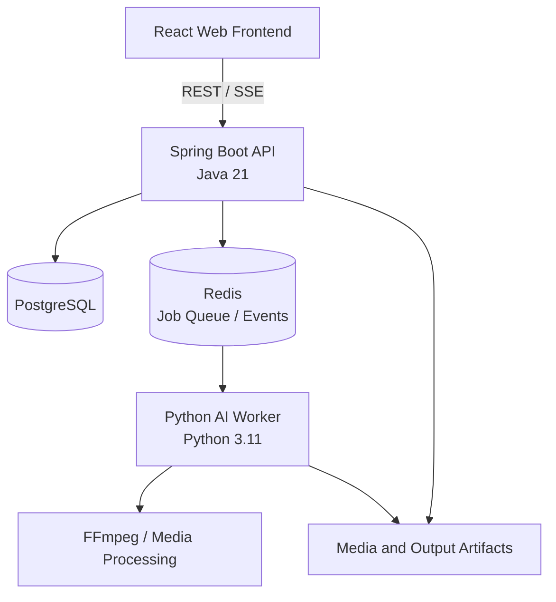

# DubFlow

AI-Powered Multilingual Video Dubbing Platform

DubFlow is a web prototype for translating and dubbing video and audio with AI. Its local Python worker contains modular ASR, diarization, translation, TTS, alignment, and rendering stages. Phase 2A adds a development-only browser/API path that sequences those existing modules; it remains a local prototype.

## Project Vision

Users will upload a video or audio file, or provide a supported video URL, then review and refine the transcript and translated dialogue before generating dubbed media.

```text
Upload video/audio or provide a supported URL
                    ↓
             Media ingestion
                    ↓
           Automatic transcription
                    ↓
             Speaker detection
                    ↓
                Translation
                    ↓
           AI voice generation
                    ↓
           Timing and alignment
                    ↓
             Final dubbed media
```

Vietnamese is the initial target language. The system should remain multilingual so additional source and target languages can be supported without redesigning the pipeline.

## Main Features — Planned

Everything in this list is **PLANNED**, not implemented:

- Video and audio upload
- Ingestion from supported URLs
- Automatic speech recognition and transcription
- Word and segment timestamps
- Speaker diarization
- Subtitle import and export
- Multilingual translation
- AI text-to-speech and voice generation
- Optional voice cloning and reference voices
- Speech timing and alignment
- Video and audio rendering
- Processing progress and status tracking
- Project and job management
- Transcript and subtitle editing
- Multiple output formats
- Future batch processing

## Target Architecture

The architecture below is a target design, not a description of existing code.



### React

- User interface and uploads
- Project management screens
- Transcript and subtitle editor
- Job progress display
- Result preview and download

### Spring Boot

- Main product API and frontend-facing endpoints
- Authentication and authorization
- Project and job management
- PostgreSQL access and API validation
- Queue and job orchestration
- Storage authorization

### PostgreSQL

Store users, projects, media metadata, transcript and translation segments, voice configurations, jobs, processing status, and output metadata. Large media files belong in file or object storage, not database rows.

### Redis

Initially provide background job queuing, job state and events, and worker coordination. Keep the queue design open to RabbitMQ if requirements change. Future caching is a possibility, not an initial requirement.

### Python Worker

Run AI inference and media processing: ASR, diarization, translation adapters, TTS, voice processing, audio processing, FFmpeg, and URL downloading where supported.

## VoiceStudio — Phase 0 Audit Summary

[VoiceStudio](https://github.com/debpalash/VoiceStudio) was audited as a potential source of reusable AI and media components. The audit found existing capabilities for:

- Media ingestion and URL downloading through `yt-dlp`
- Audio extraction and Demucs vocal separation
- ASR and timed transcript segmentation
- Speaker-related processing
- Translation providers and TTS engines
- Voice reference and cloning workflows
- Subtitle parsing
- FFmpeg-based media processing
- Dubbing generation, export, and progress/event streaming

VoiceStudio is **not** DubFlow's target architecture. Its current application is organized around its own FastAPI backend, Electron desktop app, SQLite persistence, in-memory task dispatcher, settings, and path conventions. The audit summary is based on the public repository source and documentation; local execution and hardware benchmarks remain outstanding.

## What We Will Reuse From VoiceStudio

These are candidates only. Each component still requires license, dependency, and code-boundary review before extraction.

### REUSE DIRECTLY / WITH MINIMAL ADAPTATION

- SRT parser
- Transcript segmentation helpers
- Selected audio/DSP utilities
- FFmpeg utilities
- Translation-provider concepts
- Model capability metadata

### ADAPT / WRAP

- ASR adapter and WhisperX/faster-whisper integration
- TTS adapter
- Speaker and reference-audio preparation
- Diarization and segmentation paths
- Dubbing timing/alignment helpers
- Media preparation
- Task progress/event concepts

Expose adapted functionality through explicit DubFlow Python worker interfaces rather than relying on VoiceStudio application state.

### DO NOT REUSE WHOLE

Do not carry over the following architecture wholesale:

- VoiceStudio FastAPI product server
- Electron desktop application
- Legacy Tauri shell
- SQLite persistence
- VoiceStudio in-memory task dispatcher
- VoiceStudio-specific UI state
- VoiceStudio-specific job and path configuration

These are coupled to VoiceStudio's product and conflict with DubFlow's planned React, Spring Boot, PostgreSQL, and Redis architecture.

## Technology Decisions

These are current project decisions and may be revised as implementation evidence is gathered.

### Frontend

- React with Vite
- JavaScript preferred over TypeScript
- Tailwind CSS
- shadcn/ui or an equivalent component system

### Backend

- Java 21 and Spring Boot
- Spring Web and Spring Data JPA
- REST API, with SSE or WebSocket where appropriate

### Database

- PostgreSQL

### Queue

- Redis initially
- Keep the architecture open to RabbitMQ if requirements change

### AI and Media Worker

- Python 3.11
- PyTorch
- WhisperX/faster-whisper
- Translation adapters
- TTS engines
- FFmpeg
- `yt-dlp`

### Infrastructure

- Docker and Docker Compose
- Git and GitHub

## Hardware Constraint

```text
Development GPU: NVIDIA RTX 3050 Laptop GPU
VRAM:             4 GB
```

Four GB of VRAM is a significant constraint. Model download size does **not** equal peak VRAM use. ASR, TTS, and diarization configurations must be benchmarked on the development machine. Do not assume large models will run comfortably. Smaller models, CPU execution, or offloading may be needed; model adapters should remain replaceable. No specific model is claimed to fit until measured.

## Phase 0 Findings

### Confirmed in the audited repository

VoiceStudio has ASR, translation, TTS, speaker-related processing, voice reference/clone workflows, subtitle handling, audio and video processing, FFmpeg integration, `yt-dlp` URL ingestion, and a dubbing generation/export pipeline.

### Not confirmed; requires local execution or further source inspection

- Exact peak VRAM consumption
- Runtime on an RTX 3050 with 4 GB VRAM
- Practical performance of every TTS engine
- Exact subtitle editor implementation
- Complete environment-variable inventory
- Every external engine's dependency and runtime requirements
- Reliability across all URL providers and sites

## Phase 0 Architectural Decision

> DubFlow will NOT be a direct fork of VoiceStudio.

```text
VoiceStudio
    ↓
Selected AI/media components
    ↓
Adapted Python Worker
    ↓
DubFlow architecture
```

DubFlow will own its product API, authentication, projects, jobs, database, storage, queue, frontend, and user experience. VoiceStudio-derived components may provide ASR, translation, TTS, diarization, audio processing, and media processing after review and adaptation.

## Development Strategy

```text
PHASE 0  VoiceStudio audit
   ↓
PHASE 1  Python AI Worker prototype
   ↓
PHASE 2  Spring Boot + PostgreSQL
   ↓
PHASE 3  Worker ↔ Backend + Redis
   ↓
PHASE 4  React Frontend
   ↓
PHASE 5  YouTube / URL ingestion
   ↓
PHASE 6  Subtitle / Transcript Editor
   ↓
PHASE 7  Multi-speaker / Voice features
   ↓
PHASE 8  Batch jobs / scalability
   ↓
PHASE 9  Docker / Deployment / Production hardening
```

## Phase 2A — Local browser prototype

The React/Vite frontend and FastAPI dev API exercise the existing worker stages from a browser. The API keeps job state in memory and writes uploads and generated artifacts below `worker/output/dev-api/`.

The Dev API uses KorvaTTS for Vietnamese speech in the isolated `worker/.venv-tts-korva` environment. Voice, device, and denoising steps can be set with `DUBFLOW_TTS_VOICE`, `DUBFLOW_TTS_DEVICE`, and `DUBFLOW_TTS_STEPS`. Translation defaults to NLLB (`DUBFLOW_TRANSLATION_PROVIDER=nllb`); diarization defaults to the pyannote Community-1 model on CPU. Those optional model dependencies and model access must be installed/configured in the worker environment. See [worker README](worker/README.md) for exact local commands and environment notes.

## Immediate Next Step

The current implementation phase is **PHASE 1A — Python AI Worker + ASR Vertical Slice**. Its small vertical slice is:

```text
Input video/audio
       ↓
Audio extraction
       ↓
ASR
       ↓
Timestamped transcript
       ↓
JSON result
```

The first goal is not to build the entire dubbing system. It is to benchmark the AI/media pipeline on the RTX 3050 4 GB and establish stable worker contracts. The worker prototype is implemented; CPU ASR was verified, while CUDA inference still needs its runtime libraries configured and tested.

## Phase 1 Success Criteria

Phase 1 is successful when the worker can:

1. Accept a local video or audio file.
2. Extract audio.
3. Run ASR.
4. Produce timestamped transcript segments.
5. Return structured JSON.
6. Report processing errors clearly.
7. Record basic processing time.
8. Measure or inspect GPU, CPU, and RAM usage where practical.
9. Run reproducibly on the development machine.
10. Keep the implementation modular enough to connect to Spring Boot and Redis later.

## Repository Structure — Initial Target

This is a target structure, not an implemented repository layout. It may evolve during implementation.

```text
DubFlow/
├── README.md
├── backend/                 # Spring Boot API
├── worker/                  # Python AI/media worker
├── frontend/                # React application
├── infra/                   # Docker / Redis / PostgreSQL configuration
├── docs/                    # Architecture and technical documentation
└── .gitignore
```

## Important Engineering Principles

- Keep AI inference separate from the product API.
- Do not couple AI workers directly to the frontend.
- Use explicit request and result contracts.
- Keep model engines replaceable; do not hard-code one ASR or TTS provider.
- Isolate media processing from business logic.
- Make jobs observable and design for cancellation and failure.
- Store metadata in PostgreSQL, not large binary media.
- Keep large media artifacts in file or object storage.
- Benchmark before optimizing.
- Prefer simple working vertical slices before adding distributed complexity.
- Keep every phase independently testable.

## License and Compliance

VoiceStudio is licensed under:

```text
AGPL-3.0-only
```

Individual AI models may have different licenses. TTS and voice-cloning models require separate license review. Voice cloning should only be used with appropriate permission and consent. Before redistributing VoiceStudio-derived code, review the AGPL obligations. Pin the VoiceStudio commit used for any extraction and record the source and license of every reused component and model. This section records review requirements; it is not a legal conclusion.

## Current Status

| Component | Status |
| --- | --- |
| Project concept | ✅ Defined |
| Project name | ✅ DubFlow |
| VoiceStudio audit | ✅ Phase 0 complete |
| Target architecture | ✅ Defined |
| Technology stack | ✅ Defined |
| Python worker | 🛠️ Phase 1A prototype |
| Spring Boot API | ⏳ Phase 2 |
| PostgreSQL | ⏳ Phase 2 |
| Redis | ⏳ Phase 3 |
| React frontend | ⏳ Phase 4 |
| YouTube ingestion | ⏳ Phase 5 |
| Subtitle editor | ⏳ Phase 6 |
| Multi-speaker voice | ⏳ Phase 7 |
| Production deployment | ⏳ Phase 9 |
